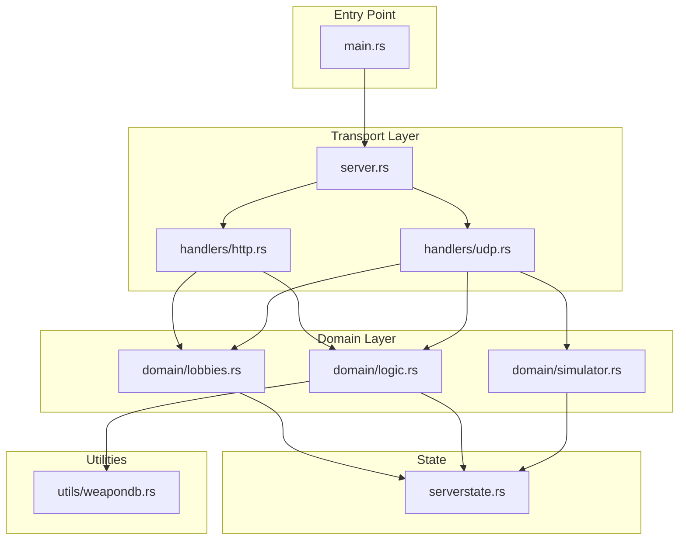

# Game Server Architecture Rewrite

## Overview

Refactor the existing monolithic server code into a clean, layered architecture with proper separation of concerns. The new structure will have thin network handlers that delegate to domain business logic modules, all sharing a thread-safe `ServerState`.

## Target Architecture




## File Structure

```javascript
server/_gungameserver/src/
  main.rs           # Entry point: logging setup, starts server
  server.rs         # HTTP + UDP server initialization
  serverstate.rs    # Arc<RwLock<ServerState>> - shared state
  handlers/
    mod.rs
    http.rs         # Thin HTTP handlers (create/join/list lobbies)
    udp.rs          # Thin UDP handlers (position, shoot, reload, etc.)
    models.rs       # Request/Response DTOs
  domain/
    mod.rs
    lobbies.rs      # Lobby management: create, join, leave, player cleanup
    logic.rs        # Combat logic: shoot, reload, take_damage, weapon_switch
    simulator.rs    # Game world simulation: collision, hitscan (stub for now)
  utils/
    mod.rs
    weapondb.rs     # Weapon data loading and queries
```


## Module Responsibilities

### 1. `main.rs`

- Setup fern logger (existing code works well)
- Call `server::start_servers()`

### 2. `server.rs`

- Create `ServerState` wrapped in `Arc<RwLock<>>`
- Initialize HTTP router with Axum routes
- Initialize UDP socket and packet loop
- Spawn background tasks (cleanup, state sync, dummy mover)

### 3. `serverstate.rs`

**Pure data container** - no business logic methods:

```rust
pub struct ServerState {
    pub lobbies: HashMap<LobbyCode, Lobby>,
    pub next_player_id: u32,
}
```

Also contains `Lobby`, `Player`, `PlayerSyncState` structs.

### 4. `handlers/http.rs`

Thin wrappers that:

1. Extract request data
2. Call domain functions with `&mut ServerState`
3. Transform result to HTTP response

Endpoints: `create_lobby`, `join_lobby`, `get_lobby`, `list_lobbies`

### 5. `handlers/udp.rs`

Thin dispatcher + handlers that:

1. Parse JSON packet type
2. Extract packet fields
3. Call appropriate domain function
4. Broadcast result to clients

Packet types: `join`, `leave`, `position_update`, `shoot`, `reload`, `weapon_switch`, `request_state`, `keepalive`

### 6. `domain/lobbies.rs`

Core lobby operations (all accept `&mut ServerState`):

- `create_lobby(state, code, max_players, scene) -> Result<&Lobby>`
- `join_lobby(state, code, player_name, weapons) -> Result<(u32, &Lobby)>`
- `leave_lobby(state, code, player_id)`
- `update_player_position(state, player_id, position, rotation)`
- `set_player_address(state, code, player_id, addr)`
- `get_lobby(state, code) -> Option<&Lobby>`
- `cleanup_inactive_players(state) -> (usize, usize)`

### 7. `domain/logic.rs`

Combat and weapon operations (all accept `&mut ServerState` + weapon db reference):

- `player_shoot(state, weapons, code, player_id) -> Result<bool>`
- `player_take_damage(state, code, player_id, damage) -> Result<()>`
- `player_start_reload(state, weapons, code, player_id) -> Result<()>`
- `update_reload_states(state) -> Vec<(String, u32)>`
- `player_switch_weapon(state, weapons, code, player_id, weapon_id) -> Result<()>`
- `get_player_state(state, code, player_id) -> Result<&Player>`
- `get_lobby_state_sync(state, code) -> Result<Vec<PlayerSyncState>>`

### 8. `domain/simulator.rs`

Placeholder for game world simulation:

- `check_line_of_sight(state, from_pos, to_pos) -> bool` (stub: returns true)
- `perform_hitscan(state, origin, direction, range) -> Option<HitResult>` (stub)
- `check_collision(position, collision_mesh) -> bool` (stub)

### 9. `utils/weapondb.rs`

Weapon database:

- `WeaponData` struct
- `WeaponDb::load() -> HashMap<u32, WeaponData>`
- `WeaponDb::get(id) -> Option<&WeaponData>`

## Key Changes from Current Code

1. **Extract business logic from ServerState** - Currently `ServerState` has methods like `player_shoot()`, `create_lobby()`. These move to domain modules.
2. **Thin handlers** - Current handlers mix networking with business logic. New handlers only: parse request -> call domain -> format response.
3. **Separate weapon data** - Move from `ServerState.weapons` to dedicated `utils/weapondb.rs`.
4. **Unit tests per module** - Each `.rs` file gets a `#[cfg(test)] mod tests` block.

## Test Strategy

Each module includes unit tests for its public functions:| Module | Test Coverage |

|--------|---------------|

| `serverstate.rs` | Struct creation, default values |

| `domain/lobbies.rs` | Create/join/leave lobby, player cleanup, full lobby handling |

| `domain/logic.rs` | Shoot (ammo, fire rate), reload, damage, weapon switch |

| `domain/simulator.rs` | Stub tests for hitscan, collision |

| `utils/weapondb.rs` | Weapon loading, data integrity |

| `handlers/http.rs` | Integration tests via mock state |

| `handlers/udp.rs` | Packet parsing, dispatch |

## Implementation Order

The implementation will proceed bottom-up (dependencies first):

1. Utils (weapondb) - no dependencies
2. State (serverstate) - data structures only
3. Domain modules (lobbies, logic, simulator) - use state + utils
4. Handlers (http, udp) - use domain
5. Server init (server.rs) - wire everything